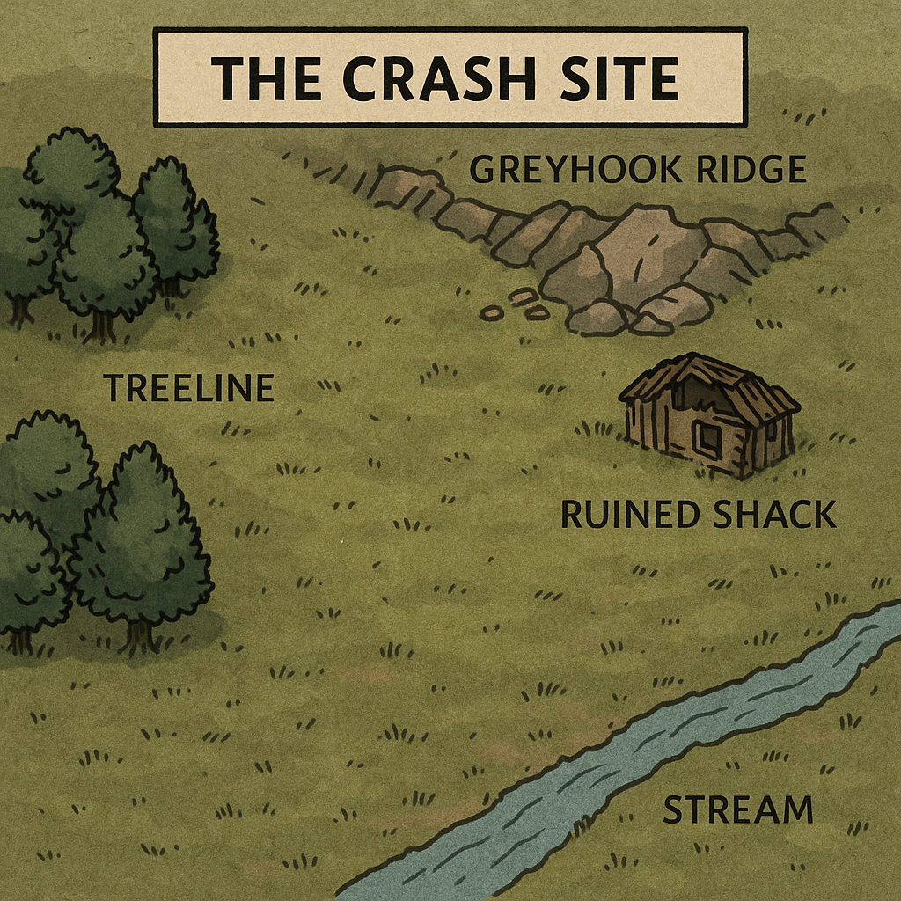

# RIMWORLD RPG — QUICKSTART ONE-SHOT

## “The First Night on Greyhook Ridge”

**Session length:** 2.5–4 hours
**Players:** 3–5 + Storyteller
**Tone:** survival drama + sudden violence + messy heroics
**Core systems used:**

* Story Die (Twist / Complication)
* Tiers (Struggle / Success / Triumph)
* Edge/Bane + Augmented/Impaired
* Needs + Mood + Stress → Mental Break risk
* Combat (AP + cover)
* Equipment + Market Value (micro use)
* Colony Day Loop (4 periods)
* Research + Build/Harvest/Hunt (light)

---

## Page 1 — What You Need to Play

### The Premise

Your shuttle breaks apart over a frozen-forest Rimworld. You crash near **Greyhook Ridge** with almost nothing. The first day decides everything: **get shelter, food, and a basic defense before nightfall**.

You are not heroes.
You are colonists.

### The One-Sentence Goal

**Survive the first night and secure a defensible foothold** — or at least ensure someone is alive to bury the bodies.

### The Table Setup

* Each player takes a pregen colonist (below).
* The Storyteller runs the day loop and interrupts it with events.
* Keep scenes short and cinematic.

### Dice & Resolution

Players always roll **2d10** (one Base + one **red Story Die**) + Attribute + Skill.

**Tiers (default):**

* **11-** Struggle
* **12–16** Success
* **17+** Triumph

**Edge/Bane:**

* **Edge:** reroll either die once
* **Bane:** Storyteller rerolls one die that looks too good

**Story Die triggers:**

* **1 = Twist of Fate** (Inspiration/Edge/boon)
* **10 = Complication** (Bane/Stress/Mood hit/new danger)

> *Use this quickstart as the “tiers-first” version (no DC needed tonight).*

---

## Page 1 — Pregenerated Colonists (3–5)

Use short stat blocks so this stays fast.

### 1) **Marla Kade — Tough Builder**

**Attributes:** Body +2, Mind +1, Reflex 0, Social -1
**Skills:** Construction +30, Shooting +20, Medicine +10
**Trait:** **Tough** (reduce incoming damage)
**Incapable:** Intellectual
**Gear:** Knife, simple toolkit, 1x medkit

### 2) **Ivo Thorne — Calm Medic**

**Attributes:** Mind +2, Social +1, Body 0, Reflex -1
**Skills:** Medicine +30, Cooking +20, Social +10
**Trait:** **Iron-Willed** (+Mental Break threshold)
**Incapable:** Violence (or “Reluctant Shooter”)
**Gear:** 2x medkits, basic rations

### 3) **Sana Voss — Trigger-Happy Hunter**

**Attributes:** Reflex +2, Body +1, Mind 0, Social -1
**Skills:** Shooting +30, Animals +20, Melee +10
**Trait:** **Bloodlust** (benefits under combat stress)
**Incapable:** Artistic
**Gear:** Bolt-action rifle, 10 ammo, hunting knife

### 4) **Oren Pell — Smooth Talker** *(optional 4th)*

**Attributes:** Social +2, Mind +1, Reflex 0, Body -1
**Skills:** Social +30, Crafting +20, Cooking +10
**Trait:** **Kind** (helps morale)
**Incapable:** Hauling
**Gear:** Trade goods, sidearm

### 5) **Tess Rook — Scrappy Researcher** *(optional 5th)*

**Attributes:** Mind +2, Reflex +1, Social 0, Body -1
**Skills:** Intellectual +30, Crafting +20, Shooting +10
**Trait:** **Nervous** (more susceptible to stress)
**Incapable:** Cooking
**Gear:** datapad, improvised tools

> **Quick skill rule for pregens:** +30 = excellent, +20 = good, +10 = basic.

---

## Page 2 — The Day Loop (4 Periods)

**Each day has 4 periods:** Dawn, Midday, Dusk, Night.
Each colonist chooses **one major action per period**.
The Storyteller frames short scenes and advances needs/mood.

### Period Actions (use 1–2 rolls each)

* **Build Shelter** (Construction)
* **Gather Resources** (Mining/Plants)
* **Hunt** (Shooting/Animals)
* **Cook** (Cooking)
* **Treat Wounds** (Medicine)
* **Research Basics** (Intellectual)
* **Scout** (Reflex/Survival)
* **Social Support** (Social) — reduce Stress or restore Mood

### Needs & Mood (light version for quickstart)

At the end of each period, apply:

* If a Need is neglected, mark **-1 Mood**.
* If two or more Needs are neglected, mark **+1 Stress**.

**Trigger a Mental Break** if a colonist reaches **3 Stress** and rolls a **Complication (Story Die 10)**.

**Quick Mental Break table (d6):**
1–2 **Wander / Shut Down**
3–4 **Food Binge**
5 **Berserk**
6 **Sadistic / Destructive Outburst**

---

## Page 2 — The Crash Site

### The Map

A shallow valley beside **Greyhook Ridge**:

* **Treeline** to the west (cover + hunt)
* **Rock outcrop** to the north (good for a barricade)
* **Ruined shack** to the east (half-collapsed)
* **Stream** south (clean water if boiled)

### Starting Supplies

* 6 simple rations
* 1 bedroll per colonist
* Scrap metal (enough for 1 barricade or 1 simple room)
* 1 basic tool kit
* 1 ranged weapon total for the team + knives
  *(Let Sana start with the rifle if she’s in play.)*

### The First Choice (Dawn)

The group must decide:
**Repair the ruin** or **build a new lean-to** near the rocks.

Use a **group check** (Construction or Survival).

* **Struggle:** shelter is weak → **night defense is harder**
* **Success:** decent shelter
* **Triumph:** shelter + basic barricade

---

## Page 3 — Scripted Events (use 2 of 3)

You only need two major events to hit all systems.

### Event A — The Injured Wanderer (Midday)

A lone survivor stumbles in, bleeding and delirious.
They have a **pack of medicine + a pistol**.

**Choices:**

* Help them (Medicine + Social)
* Rob them (Melee/Social)
* Turn them away (Mood impact)

**Twist (Story Die 1):**
They reveal a **cache location** nearby.
**Complication (Story Die 10):**
They’re being tracked.

This scene comes with an easy opportunity to introduce **Social Support**, **Mood**, and **Ethics under pressure**.

---

### Event B — The Trader with Bad Timing (Dusk)

A small caravan arrives.
They’ll trade **ammo, a heater, or food**.

Run a quick **Market Value** moment:

* Social skill can improve deals.
* Players can trade scrap, rations, or favors.

**Twist:**
Trader offers a cheap turret blueprint.
**Complication:**
Trader accidentally leads danger to your camp.

This is your light introduction to **economy** and **colony tech stakes**.

---

### Event C — The Weather Knife (Any time)

A sudden cold snap and windstorm.

Mechanically:

* If shelter is weak → everyone gains **+1 Stress**
* Cooking / Rest actions are harder
* Hypothermia risk in the night fight

This supports **Needs/Mood/Stress** pressure.

---

## Page 3 — The Night Threat (Finale)

Pick one based on your table’s vibe:

### Option 1 — **Manhunter Pack**

A pack of 6–10 maddened wolves or feral dogs charges at night.
They target **the noisiest or weakest** colonist first.

**Play tips:**

* Emphasize **cover**, **kiting**, and **triage**
* Let a **Triumph** enable clever tactics (trap use, collapsing ruin, etc.)

### Option 2 — **Desperate Raiders**

2–4 poorly equipped raiders attack looking for supplies.
They attempt intimidation first.

Use:

* A short **Social showdown** before bullets
* Then **combat**

**Twist:**
One raider is barely a teenager.
**Complication:**
They set fire to your only shelter.

---

## Page 4 — Victory, Fallout, and Fast Debrief

### Win Conditions

The colony “wins” if, by morning:

* At least **two colonists alive**, and
* The group has **shelter + either food or basic defenses**.

### If They Barely Survive

That is the *correct* RimWorld vibe.
End with:

* A quiet sunrise
* A body being buried
* A promise of the next season

### Rewards (light campaign hook)

* Everyone gains **+10 Skill Points** in one used skill
* The colony gains **1 Research Point**
* The group chooses a **Storyteller mode** for next session
  (Cassandra / Phoebe / Randy)

---

# Storyteller Cheat Sheet (tiny box)

### Pacing Outline

1. **Dawn:** crash, first shelter decision
2. **Midday:** injured wanderer + medical dilemma
3. **Dusk:** trader + last-minute preparations
4. **Night:** raid/manhunters + stress spikes
5. **Morning:** aftermath + hook

### Use the Story Die Loudly

Whenever it shows:

* **1:** reward bravery, ingenuity, kindness
* **10:** force a hard choice or reveal a second-layer threat

---

# Why This One-Shot Works

In one evening, your players will:

* Understand the **Story Die identity**
* See how **Struggle still pushes the story forward**
* Feel the **RimWorld pressure loop**
* Touch **colony play** without drowning in spreadsheets
* Leave wanting “Session 2: The First Winter”

---

## Tiny Optional Add-ons (if you want to reach 4 full pages cleanly)

* Add a **single-page printable “Colony Sheet Lite”**:

  * Food stock
  * Shelter quality
  * Defenses
  * Research
  * Goodwill
* Add a **1-paragraph teaser quest**:

  * “A muffalo herd migrates near your valley tomorrow…”
  * “A nearby ancient danger emits a faint signal…”

